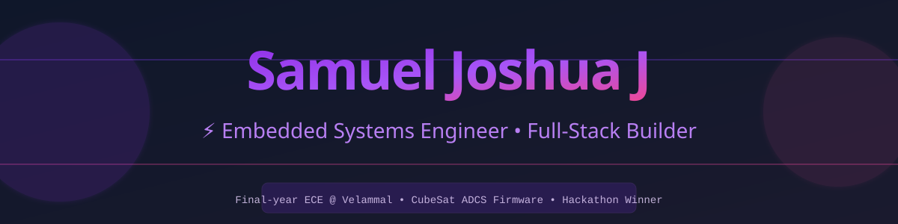

<p align="center">
  
</p>

<br>

<p align="center">
  <a href="mailto:ktmsjsam@gmail.com"></a>
  <a href="https://www.linkedin.com/in/samuel-joshua-j-5491a72a9/"></a>
  <a href="https://github.com/Samdcruzzz"></a>
</p>

<p align="center">📍 Chennai, Tamil Nadu &nbsp;·&nbsp; 🎓 Final-year ECE Student &nbsp;·&nbsp; 🏆 Hackathon Winner</p>

<br>

## 👨‍💻 About Me

I build firmware close to the metal and software close to the user. I recently wrapped up an internship at **Harpy Aerospace** writing CubeSat ADCS firmware — B-dot detumbling, magnetorquer control, FreeRTOS mode management — the kind of work where a single race condition can end a mission. On the other side, I build and ship full web platforms end-to-end, from backend APIs to deployed products used by real people.

```text
const samuel = {
    role:        "Embedded Systems & Firmware Engineer",
    currentWork: ["CubeSat ADCS firmware", "AI-assisted web platforms"],
    learning:    "RTOS internals & real-time systems design",
    funFact:     "Plays zonal-level hockey between debugging sessions"
};
```

<br>

## 🛠️ Skills & Expertise

<p align="center">
  
</p>

<details>
<summary><b>Expand for full skill breakdown</b></summary>

**Embedded & RTOS:**
`Embedded C` `C++` `STM32H7` `FreeRTOS` `Arduino` `ESP32` `Unit Testing (Unity)`

**Protocols & Electronics:**
`UART` `SPI` `I2C` `CAN` `PWM` `CCSDS` `Sensor Interfacing` `PCB Basics`

**Software & Web:**
`Python` `Java` `JavaScript` `HTML5` `CSS3` `Node.js` `Express.js` `React 19` `TypeScript`

**Tools & Platforms:**
`Git & GitHub` `Keil uVision` `MATLAB` `VS Code` `Vercel` `Render` `Postman`

</details>

<br>

## 💼 Experience

**Embedded Engineer Intern** — Harpy Aerospace Private Limited  
*May 2026 – Jul 2026*
- Built CubeSat ADCS firmware in Embedded C on FreeRTOS — B-dot detumbling control, magnetorquer PWM drive, and event-group mode management across SAFE/DETUMBLING/NOMINAL states
- Debugged and unified the BMX160 IMU driver, backed by a hand-mocked Unity test suite
- Integrated sensor data pipelines with spacecraft telemetry systems

**Intern** — Airport Authority of India  
*Nov 2025 – Dec 2025*
- Analyzed X-ray scanners, CCTV, and telecom infrastructure in airport security systems
- Documented detection technologies and surveillance architecture in technical reports

**In-Plant Trainee** — Globesic Technologies Pvt Ltd  
*Dec 2024*
- Hands-on embedded systems fundamentals and real-time applications
- Sensor and actuator interfacing techniques

<br>

## 🚀 Featured Projects

<table>
<tr>
<td width="50%" valign="top">

### 🛰️ CubeSat ADCS Firmware
B-dot detumbling, magnetorquer PWM control, FreeRTOS state management for a real CubeSat mission. Unity-tested, hand-mocked, production-grade.

`Embedded C` `STM32H7` `FreeRTOS` `Unity`

*Proprietary — not public*

</td>
<td width="50%" valign="top">

### 🧭 Career Compass
AI-guided college admissions platform for 12th-graders — covers all 38 TN districts, marks-aware recommendations, live demo with 200+ college database.

`Node.js` `Express` `OpenRouter API` `Vercel`

[🔗 Live Demo](https://career-compass-s6l5.onrender.com/) · [📦 GitHub](https://github.com/Samdcruzzz/Career-Compass)

</td>
</tr>
<tr>
<td width="50%" valign="top">

### 🔋 EV Guardian
Predictive-maintenance dashboard for EV telemetry — Gemini-powered health scoring, root-cause diagnosis, rule-based fallback architecture.

`React 19` `TypeScript` `Gemini API` `Tailwind`

[🔗 Live Demo](https://ev-guardian-h0dk5vfut-nova-minds1.vercel.app) · [📦 GitHub](https://github.com/Samdcruzzz/EV-Guardian)

</td>
<td width="50%" valign="top">

### 📲 PingSense
WhatsApp notification router — OCR, offline speech recognition, scam/prompt-injection filtering. **83.3% action accuracy.**

`Python` `pytesseract` `Anthropic API` `Flask`

[📦 GitHub](https://github.com/Samdcruzzz/PingSense-Orchestrate)

</td>
</tr>
<tr>
<td width="50%" valign="top">

### ♻️ Paper Sage
Sensor-driven recyclable/non-recyclable paper sorter. **🥇 National Hackathon 360° 3.0 Winner.**

`Microcontroller` `Sensor Array` `Actuators` `Computer Vision`

[📦 GitHub](https://github.com/Samdcruzzz/Paper-Sage)

</td>
<td width="50%" valign="top">

### 💡 Smart Light Control
LDR + IR-based auto-brightness and motion-responsive lighting system. Deployed in lab environment.

`Arduino` `Embedded C` `PWM` `Sensor Fusion`

[📦 GitHub](https://github.com/Samdcruzzz/Light-Intensity)

</td>
</tr>
</table>

<br>

## 🎓 Education

| Degree | Institution | Duration | Score |
|:--|:--|:--|:--|
| **B.E. Electronics & Communication Engineering** | Velammal Engineering College | 2023 – 2027 | CGPA 7.49 |
| **HSC** | I.C.F Silver Jubilee Matriculation & HSS | 2022 – 2023 | 78.83% |
| **SSLC** | I.C.F Silver Jubilee Matriculation & HSS | 2020 – 2021 | 100% |

<br>

## 🏆 Achievements

| Award | Event | Institution |
|:--|:--|:--|
| 🥇 **Winner** — Best Innovators | National Level Hackathon 360° 3.0 | KPR Institute of Engineering & Technology |
| 🥈 **2nd Place** | Project Expo | Velammal Engineering College |
| 🥉 **3rd Place** | Paper Presentation | St. Joseph College of Engineering |
| 🥉 **3rd Prize** | Shark Tank Innovation Challenge | Madras Institute of Technology |
| 🥉 **3rd Prize** | Innovative Product | Velammal Engineering College |
| ✦ **Special Mention** | Project Expo | Sri Ramakrishna Engineering College |

<br>

## 📜 Certifications

- Advance Diploma in Python Programming — CSC
- Cryptography & Network Security — NPTEL
- The Future of Full Stack Development: Key Skills Needed in 2026 — GUVI × HCL
- **Orchestrate** — Built & Deployed an AI Agent — HackerRank *(Rank #1090 / 1,983, Aug 2026)*

<br>

## 📫 Recent Activity

<!--START_SECTION:activity-->
Recent Activity:
- `Redesign profile README with animated stats, banner, and featured projects`
- `chore: update README activity [skip ci]`
- `chore: add profile assets and CI workflow`
<!--END_SECTION:activity-->

<br>

## 💬 Connect with Me

<p align="center">
  <a href="mailto:ktmsjsam@gmail.com"></a><br>
  <a href="https://www.linkedin.com/in/samuel-joshua-j-5491a72a9/"></a><br>
  <a href="https://github.com/Samdcruzzz"></a>
</p>

<br>

<p align="center"><i>"Building at the intersection of hardware and software — where firmware meets the world."</i></p>

<p align="center">
  
</p>
