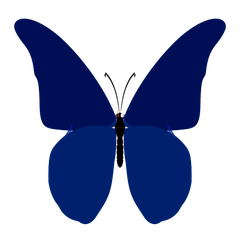

<div align="center">

<img src="data:image/svg+xml;base64,PHN2ZyB2aWV3Qm94PSIwIDAgMTIwMCAzMDAiIHhtbG5zPSJodHRwOi8vd3d3LnczLm9yZy8yMDAwL3N2ZyI+CiAgPGRlZnM+CiAgICA8IS0tIERhcmsgYmFja2dyb3VuZCAtLT4KICAgIDxsaW5lYXJHcmFkaWVudCBpZD0iYmdHcmFkaWVudCIgeDE9IjAlIiB5MT0iMCUiIHgyPSIxMDAlIiB5Mj0iMTAwJSI+CiAgICAgIDxzdG9wIG9mZnNldD0iMCUiIHN0eWxlPSJzdG9wLWNvbG9yOiMwZjE3MmE7c3RvcC1vcGFjaXR5OjEiIC8+CiAgICAgIDxzdG9wIG9mZnNldD0iMTAwJSIgc3R5bGU9InN0b3AtY29sb3I6IzFhMWEyZTtzdG9wLW9wYWNpdHk6MSIgLz4KICAgIDwvbGluZWFyR3JhZGllbnQ+CgogICAgPCEtLSBCcmlnaHQgY3lhbiAtPiBwdXJwbGUgLT4gcGluayB0ZXh0IGdyYWRpZW50IC0tPgogICAgPGxpbmVhckdyYWRpZW50IGlkPSJ0ZXh0R3JhZGllbnQiIHgxPSIwJSIgeTE9IjAlIiB4Mj0iMTAwJSIgeTI9IjEwMCUiPgogICAgICA8c3RvcCBvZmZzZXQ9IjAlIiBzdHlsZT0ic3RvcC1jb2xvcjojMjJkM2VlO3N0b3Atb3BhY2l0eToxIiAvPgogICAgICA8c3RvcCBvZmZzZXQ9IjUwJSIgc3R5bGU9InN0b3AtY29sb3I6I2MwMjZkMztzdG9wLW9wYWNpdHk6MSIgLz4KICAgICAgPHN0b3Agb2Zmc2V0PSIxMDAlIiBzdHlsZT0ic3RvcC1jb2xvcjojZjQzZjVlO3N0b3Atb3BhY2l0eToxIiAvPgogICAgPC9saW5lYXJHcmFkaWVudD4KCiAgICA8IS0tIEJ1dHRlcmZseSB3aW5nIGdyYWRpZW50IC0tPgogICAgPGxpbmVhckdyYWRpZW50IGlkPSJ3aW5nR3JhZGllbnQiIHgxPSIwJSIgeTE9IjAlIiB4Mj0iMTAwJSIgeTI9IjEwMCUiPgogICAgICA8c3RvcCBvZmZzZXQ9IjAlIiBzdHlsZT0ic3RvcC1jb2xvcjojMjJkM2VlO3N0b3Atb3BhY2l0eToxIiAvPgogICAgICA8c3RvcCBvZmZzZXQ9IjEwMCUiIHN0eWxlPSJzdG9wLWNvbG9yOiNmNDNmNWU7c3RvcC1vcGFjaXR5OjEiIC8+CiAgICA8L2xpbmVhckdyYWRpZW50PgoKICAgIDwhLS0gQWNjZW50IGdsb3cgLS0+CiAgICA8ZmlsdGVyIGlkPSJnbG93Ij4KICAgICAgPGZlR2F1c3NpYW5CbHVyIHN0ZERldmlhdGlvbj0iMyIgcmVzdWx0PSJjb2xvcmVkQmx1ciIvPgogICAgICA8ZmVNZXJnZT4KICAgICAgICA8ZmVNZXJnZU5vZGUgaW49ImNvbG9yZWRCbHVyIi8+CiAgICAgICAgPGZlTWVyZ2VOb2RlIGluPSJTb3VyY2VHcmFwaGljIi8+CiAgICAgIDwvZmVNZXJnZT4KICAgIDwvZmlsdGVyPgoKICAgIDwhLS0gU3VidGxlIGFuaW1hdGlvbiAtLT4KICAgIDxzdHlsZT4KICAgICAgQGtleWZyYW1lcyBmbG9hdCB7CiAgICAgICAgMCUsIDEwMCUgeyB0cmFuc2Zvcm06IHRyYW5zbGF0ZVkoMHB4KSByb3RhdGUoMGRlZyk7IH0KICAgICAgICA1MCUgeyB0cmFuc2Zvcm06IHRyYW5zbGF0ZVkoLThweCkgcm90YXRlKDRkZWcpOyB9CiAgICAgIH0KICAgICAgLmZsb2F0aW5nIHsKICAgICAgICBhbmltYXRpb246IGZsb2F0IDNzIGVhc2UtaW4tb3V0IGluZmluaXRlOwogICAgICAgIHRyYW5zZm9ybS1vcmlnaW46IGNlbnRlcjsKICAgICAgfQogICAgPC9zdHlsZT4KICA8L2RlZnM+CgogIDwhLS0gQmFja2dyb3VuZCAtLT4KICA8cmVjdCB3aWR0aD0iMTIwMCIgaGVpZ2h0PSIzMDAiIGZpbGw9InVybCgjYmdHcmFkaWVudCkiLz4KCiAgPCEtLSBBY2NlbnQgbGluZXMgLS0+CiAgPGxpbmUgeDE9IjAiIHkxPSI4MCIgeDI9IjEyMDAiIHkyPSI4MCIgc3Ryb2tlPSIjMjJkM2VlIiBzdHJva2Utd2lkdGg9IjIiIG9wYWNpdHk9IjAuNSIvPgogIDxsaW5lIHgxPSIwIiB5MT0iMjIwIiB4Mj0iMTIwMCIgeTI9IjIyMCIgc3Ryb2tlPSIjZjQzZjVlIiBzdHJva2Utd2lkdGg9IjIiIG9wYWNpdHk9IjAuNSIvPgoKICA8IS0tIExlZnQgYWNjZW50IGNpcmNsZSAoYmx1cnJlZCkgLS0+CiAgPGNpcmNsZSBjeD0iODAiIGN5PSIxNTAiIHI9IjEyMCIgZmlsbD0iI2MwMjZkMyIgb3BhY2l0eT0iMC4yIiBmaWx0ZXI9InVybCgjZ2xvdykiLz4KCiAgPCEtLSBSaWdodCBhY2NlbnQgY2lyY2xlIChibHVycmVkKSAtLT4KICA8Y2lyY2xlIGN4PSIxMTIwIiBjeT0iMTUwIiByPSIxMDAiIGZpbGw9IiMyMmQzZWUiIG9wYWNpdHk9IjAuMTgiIGZpbHRlcj0idXJsKCNnbG93KSIvPgoKICA8IS0tIEJ1dHRlcmZseSBwZXJjaGVkIG9uIHRoZSAiUyIgLS0+CiAgPGcgY2xhc3M9ImZsb2F0aW5nIiB0cmFuc2Zvcm09InRyYW5zbGF0ZSgyODMsNDIpIHNjYWxlKDEuNSkiPgogICAgPGVsbGlwc2UgY3g9Ii0xMSIgY3k9Ii05IiByeD0iMTQiIHJ5PSIxMCIgZmlsbD0idXJsKCN3aW5nR3JhZGllbnQpIiBvcGFjaXR5PSIwLjk1IiB0cmFuc2Zvcm09InJvdGF0ZSgtMjUgLTExIC05KSIvPgogICAgPGVsbGlwc2UgY3g9Ii04IiBjeT0iOSIgcng9IjEwIiByeT0iNyIgZmlsbD0idXJsKCN3aW5nR3JhZGllbnQpIiBvcGFjaXR5PSIwLjg1IiB0cmFuc2Zvcm09InJvdGF0ZSgtMTUgLTggOSkiLz4KICAgIDxlbGxpcHNlIGN4PSIxMSIgY3k9Ii05IiByeD0iMTQiIHJ5PSIxMCIgZmlsbD0idXJsKCN3aW5nR3JhZGllbnQpIiBvcGFjaXR5PSIwLjk1IiB0cmFuc2Zvcm09InJvdGF0ZSgyNSAxMSAtOSkiLz4KICAgIDxlbGxpcHNlIGN4PSI4IiBjeT0iOSIgcng9IjEwIiByeT0iNyIgZmlsbD0idXJsKCN3aW5nR3JhZGllbnQpIiBvcGFjaXR5PSIwLjg1IiB0cmFuc2Zvcm09InJvdGF0ZSgxNSA4IDkpIi8+CiAgICA8ZWxsaXBzZSBjeD0iMCIgY3k9IjAiIHJ4PSIyLjIiIHJ5PSIxNSIgZmlsbD0iI2ZhY2MxNSIvPgogICAgPGxpbmUgeDE9IjAiIHkxPSItMTMiIHgyPSItNiIgeTI9Ii0yMSIgc3Ryb2tlPSIjZmFjYzE1IiBzdHJva2Utd2lkdGg9IjEuNSIgc3Ryb2tlLWxpbmVjYXA9InJvdW5kIi8+CiAgICA8bGluZSB4MT0iMCIgeTE9Ii0xMyIgeDI9IjYiIHkyPSItMjEiIHN0cm9rZT0iI2ZhY2MxNSIgc3Ryb2tlLXdpZHRoPSIxLjUiIHN0cm9rZS1saW5lY2FwPSJyb3VuZCIvPgogICAgPGNpcmNsZSBjeD0iLTYiIGN5PSItMjEiIHI9IjEuNiIgZmlsbD0iI2ZhY2MxNSIvPgogICAgPGNpcmNsZSBjeD0iNiIgY3k9Ii0yMSIgcj0iMS42IiBmaWxsPSIjZmFjYzE1Ii8+CiAgPC9nPgoKICA8IS0tIE1haW4gdGl0bGUgLS0+CiAgPHRleHQKICAgIHg9IjYwMCIKICAgIHk9IjEyMCIKICAgIGZvbnQtZmFtaWx5PSInU2Vnb2UgVUknLCAnSGVsdmV0aWNhIE5ldWUnLCBzYW5zLXNlcmlmIgogICAgZm9udC1zaXplPSI3MiIKICAgIGZvbnQtd2VpZ2h0PSI3MDAiCiAgICB0ZXh0LWFuY2hvcj0ibWlkZGxlIgogICAgZmlsbD0idXJsKCN0ZXh0R3JhZGllbnQpIgogICAgbGV0dGVyLXNwYWNpbmc9Ii0yIgogID5TYW11ZWwgSm9zaHVhIEo8L3RleHQ+CgogIDwhLS0gU3VidGl0bGUgLS0+CiAgPHRleHQKICAgIHg9IjYwMCIKICAgIHk9IjE4NSIKICAgIGZvbnQtZmFtaWx5PSInU2Vnb2UgVUknLCAnSGVsdmV0aWNhIE5ldWUnLCBzYW5zLXNlcmlmIgogICAgZm9udC1zaXplPSIyOCIKICAgIHRleHQtYW5jaG9yPSJtaWRkbGUiCiAgICBmaWxsPSIjNWVlYWQ0IgogICAgb3BhY2l0eT0iMC45NSIKICA+4pqhIEVtYmVkZGVkIFN5c3RlbXMgRW5naW5lZXIg4oCiIEZ1bGwtU3RhY2sgQnVpbGRlcjwvdGV4dD4KCiAgPCEtLSBCb3R0b20gYWNjZW50IGJhZGdlIGFyZWEgKGZvciBhY2hpZXZlbWVudHMpIC0tPgogIDxyZWN0IHg9IjM1MCIgeT0iMjQ1IiB3aWR0aD0iNTAwIiBoZWlnaHQ9IjQwIiByeD0iOCIgZmlsbD0iI2MwMjZkMyIgb3BhY2l0eT0iMC4yIiBzdHJva2U9IiMyMmQzZWUiIHN0cm9rZS13aWR0aD0iMS4yIi8+CiAgPHRleHQKICAgIHg9IjYwMCIKICAgIHk9IjI3MiIKICAgIGZvbnQtZmFtaWx5PSInQ291cmllciBOZXcnLCBtb25vc3BhY2UiCiAgICBmb250LXNpemU9IjE0IgogICAgdGV4dC1hbmNob3I9Im1pZGRsZSIKICAgIGZpbGw9IiNmZGU2OGEiCiAgICBvcGFjaXR5PSIwLjkiCiAgPkZpbmFsLXllYXIgRUNFIEAgVmVsYW1tYWwg4oCiIEN1YmVTYXQgQURDUyBGaXJtd2FyZSDigKIgSGFja2F0aG9uIFdpbm5lcjwvdGV4dD4KPC9zdmc+Cg==" width="100%"/>

<a href="https://samueljoshua.netlify.app/">
  
</a>

<br/><br/>

<a href="mailto:ktmsjsam@gmail.com"></a>&nbsp;&nbsp;
<a href="https://www.linkedin.com/in/samuel-joshua-j-5491a72a9/"></a>&nbsp;&nbsp;
<a href="https://github.com/Samdcruzzz"></a>&nbsp;&nbsp;
<a href="https://samueljoshua.netlify.app/"></a>

<br/><br/>

&nbsp;
&nbsp;
&nbsp;


</div>


## 👨‍🚀 About Me

I build firmware close to the metal and software close to the user. I recently wrapped up an internship at **Harpy Aerospace**, writing CubeSat ADCS firmware — B-dot detumbling, magnetorquer control, FreeRTOS mode management — the kind of work where a single race condition can end a mission. On the other side, I design and ship AI-assisted web platforms end-to-end: backend APIs, agentic pipelines, and deployed products real people use.

```javascript
const samuel = {
    role        : "Embedded Systems & Firmware Engineer",
    currentWork : ["CubeSat ADCS firmware", "AI-orchestrated health-tech", "vision-language sat imagery"],
    learning    : "RTOS internals & real-time systems design",
    philosophy  : "test like the mission depends on it — because it does",
    funFact     : "debugs IMU drivers by day, plays zonal-level hockey by evening"
};
```


## 🧠 Tech Arsenal

<div align="center">


</div>

<br/>

<table width="100%">
<tr><td width="30%"><b>🛰️ Embedded &amp; RTOS</b></td><td>


</td></tr>
<tr><td><b>📡 Protocols &amp; Electronics</b></td><td>


</td></tr>
<tr><td><b>🌐 Software &amp; Web</b></td><td>


</td></tr>
<tr><td><b>🛠️ Tools &amp; Platforms</b></td><td>


</td></tr>
</table>


## 💼 Experience

<table width="100%">
<tr>
<td width="26%" valign="top"><b>May 2026 – Jul 2026</b><br/><sub>Villivakkam / Remote</sub></td>
<td valign="top">

**Embedded Engineer Intern** · Harpy Aerospace Private Limited
- Built CubeSat ADCS firmware in Embedded C on FreeRTOS — B-dot detumbling control, magnetorquer PWM drive, and event-group mode management across SAFE / DETUMBLING / NOMINAL states
- Debugged and unified the BMX160 IMU driver, backed by a hand-mocked Unity test suite
- Integrated sensor data pipelines with spacecraft telemetry systems

</td>
</tr>
<tr>
<td valign="top"><b>Nov 2025 – Dec 2025</b></td>
<td valign="top">

**Intern** · Airport Authority of India
- Analyzed X-ray scanners, CCTV, and telecom infrastructure in airport security systems
- Documented detection technologies and surveillance architecture in technical reports

</td>
</tr>
<tr>
<td valign="top"><b>Dec 2024</b></td>
<td valign="top">

**In-Plant Trainee** · Globesic Technologies Pvt Ltd
- Hands-on embedded systems fundamentals and real-time applications
- Sensor and actuator interfacing techniques

</td>
</tr>
</table>


## 🚀 Featured Projects

<table width="100%">

<tr>
<td width="50%" valign="top">

### 🛰️ CubeSat ADCS Firmware
B-dot detumbling, magnetorquer PWM control, FreeRTOS state management for a real CubeSat mission. Unity-tested, hand-mocked, production-grade.

`Embedded C` `STM32H7` `FreeRTOS` `Unity`

🔒 *Proprietary aerospace codebase — not public*

</td>
<td width="50%" valign="top">

### 🧭 Career Compass
AI-guided college admissions platform for 12th-graders — covers all 38 TN districts, marks-aware recommendations, live demo with a 200+ college database.

`Node.js` `Express` `OpenRouter API`

[🔗 Live Demo](https://career-compass-s6l5.onrender.com/) · [📦 GitHub](https://github.com/Samdcruzzz/Career-Compass)

</td>
</tr>

<tr>
<td width="50%" valign="top">

### 🌌 SatQuery
Vision-language assistant for analyzing satellite imagery (optical + SAR) via plain-language queries, with agentic routing to specialist models and auditable outputs.

`Vision-Language Models` `Agentic Routing` `HTML`


[📦 GitHub](https://github.com/Samdcruzzz/SatQuery)

</td>
<td width="50%" valign="top">

### 🧬 Continnum
AI-orchestrated health memory platform for elderly care — unifies fragmented medical records and flags polypharmacy, cognitive decline, and consent risks in real time.

`Python` `AI Orchestration` `Health-Tech`

[📦 GitHub](https://github.com/Samdcruzzz/continnum)

</td>
</tr>

<tr>
<td width="50%" valign="top">

### ♻️ Paper Sage
Sensor-driven recyclable / non-recyclable paper sorter. **🥇 National Hackathon 360° 3.0 Winner.**

`Microcontroller` `Sensor Array` `Actuators`

[📦 GitHub](https://github.com/Samdcruzzz/Paper-Sage)

</td>
<td width="50%" valign="top">

### 🔋 EV Guardian
Predictive-maintenance dashboard for EV telemetry — Gemini-powered health scoring, root-cause diagnosis, rule-based fallback architecture.

`React 19` `TypeScript` `Gemini API`

[🔗 Live Demo](https://ev-guardian-h0dk5vfut-nova-minds1.vercel.app) · [📦 GitHub](https://github.com/Samdcruzzz/EV-Guardian)

</td>
</tr>

</table>

<details>
<summary><b>🗂️ More Projects — click to expand</b></summary>
<br/>

| Project | Description | Stack |
|:--|:--|:--|
| 📲 [**PingSense**](https://github.com/Samdcruzzz/PingSense-Orchestrate) | WhatsApp notification router — OCR, offline speech recognition, scam/prompt-injection filtering. **83.3% action accuracy.** | `Python` `pytesseract` `Anthropic API` |
| 🎉 [**AllCollegeEvent**](https://github.com/Samdcruzzz) | Gamified campus event platform & Gen Z community hub — discover fests, earn XP, build squads, AI-powered itineraries. | `TypeScript` `MIT License` |
| 💡 [**Smart Light Control**](https://github.com/Samdcruzzz/Light-Intensity) | LDR + IR-based auto-brightness and motion-responsive lighting system. Deployed in a lab environment. | `Arduino` `Embedded C` `PWM` |

</details>


## 🎓 Education

| Degree | Institution | Duration | Score |
|:--|:--|:--|:--|
| **B.E. Electronics & Communication Engineering** | Velammal Engineering College | 2023 – 2027 | CGPA 7.49 |
| **HSC** | I.C.F Silver Jubilee Matriculation & HSS | 2022 – 2023 | 78.83% |
| **SSLC** | I.C.F Silver Jubilee Matriculation & HSS | 2020 – 2021 | 100% |


## 🏆 Achievements

| Award | Event | Institution |
|:--|:--|:--|
| 🥇 **Winner** — Best Innovators | National Level Hackathon 360° 3.0 | KPR Institute of Engineering & Technology |
| 🥈 **2nd Place** | Project Expo | Velammal Engineering College |
| 🥉 **3rd Place** | Paper Presentation | St. Joseph College of Engineering |
| 🥉 **3rd Prize** | Shark Tank Innovation Challenge | Madras Institute of Technology |
| 🥉 **3rd Prize** | Innovative Product | Velammal Engineering College |
| ✦ **Special Mention** | Project Expo | Sri Ramakrishna Engineering College |

<div align="center">

</div>

## 📜 Certifications

- 🎖️ Advance Diploma in Python Programming — CSC
- 🔐 Cryptography & Network Security — NPTEL
- 💻 The Future of Full Stack Development: Key Skills Needed in 2026 — GUVI × HCL
- 🤖 **Orchestrate** — Built & Deployed an AI Agent — HackerRank *(Rank #1090 / 1,983, Aug 2026)*


## 📫 Recent Activity

<!--START_SECTION:activity-->
Recent Activity:
- `Update README.md`
- `Deploy to GitHub pages`
- `chore: update README activity [skip ci]`
<!--END_SECTION:activity-->


## 🐍 Contribution Graph

<div align="center">

<sub>Animates automatically once the <code>snake.yml</code> workflow (included) runs — see setup note below.</sub>
</div>

<div align="center">

## 💬 Let's Build Something

<a href="https://samueljoshua.netlify.app/"></a>

<br/><br/>

<a href="mailto:ktmsjsam@gmail.com"></a>&nbsp;&nbsp;
<a href="https://www.linkedin.com/in/samuel-joshua-j-5491a72a9/"></a>&nbsp;&nbsp;
<a href="https://github.com/Samdcruzzz"></a>&nbsp;&nbsp;
<a href="https://samueljoshua.netlify.app/"></a>

<br/><br/>

<i>"Building at the intersection of hardware and software — where firmware meets the world."</i>

<br/><br/>



<br/>


</div>
